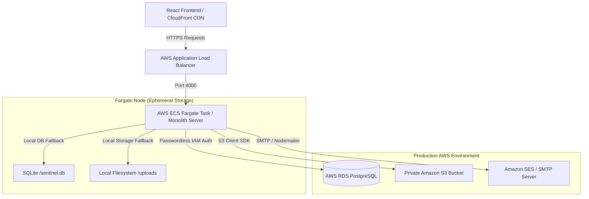
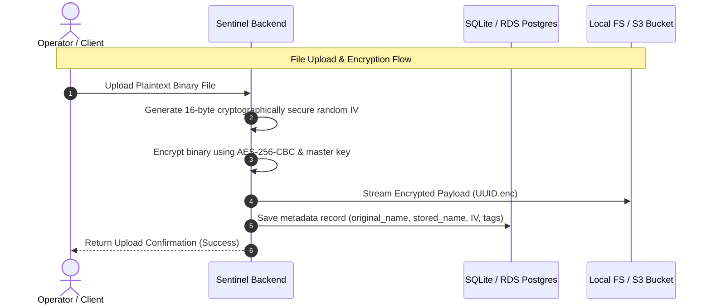

# System Architecture Guide — SENTINEL VAULT

This document outlines the system architecture, infrastructure components, cryptographic design, and deployment setups for **SENTINEL VAULT**.

---

## 1. High-Level Architecture Overview

Sentinel Vault is structured to support both a streamlined monolithic container deployment (perfect for isolated tasks and AWS Fargate ECS workloads) and a microservices design.

---

## 2. Infrastructure & Component Design

### 2.1 Frontend Client
* **Framework:** React + Vite + Tailwind CSS / Custom Modern Cyber-Ops UI.
* **Hosting:** Static assets built and distributed globally via **AWS S3** and **Amazon CloudFront** CDN.
* **Routing:** Single-Page Application (SPA) calling the backend `/api/*` proxies.

### 2.2 Backend Application (Monolithic ECS Fargate Server)
* **Runtime:** Node.js + TypeScript + Express.js.
* **Containerization:** Ephemeral multi-stage Docker builds.
* **Deployment Platform:** **AWS ECS (Fargate)** with **AWS Application Load Balancer (ALB)** mapping requests on port `4000`.

### 2.3 Storage Tier (Private Object Storage)
* **Local Staging:** Local disk storage fallback (`uploads/` directory).
* **Production Storage:** **Amazon S3** object storage. Encrypted payload binaries are streamed directly into private buckets. No public read access is permitted; files are read-streamed through the authorized backend.

### 2.4 Metadata & Logging Tier (Relational Storage)
* **Local Staging:** SQLite database (`sentinel.db`) running in write-ahead log (WAL) mode.
* **Production Storage:** **AWS RDS PostgreSQL** cluster.
* **Connection Security:** Uses **AWS RDS IAM Authentication**. Instead of long-lived static database passwords, the database adapter dynamically queries and rotates AWS RDS authorization tokens every 15 minutes.

---

## 3. Cryptographic Design (AES-256-CBC Payload Protection)

To protect files at rest against physical node compromise or bucket exposure:

1. **Upload / Encryption Flow:**
   * A file is uploaded via `/api/files/upload`.
   * The backend generates a unique, cryptographically secure 16-byte **Initialization Vector (IV)**.
   * The file buffer is encrypted in memory using the **AES-256-CBC** algorithm, using the generated IV and a server-side Master Key (`ENCRYPTION_KEY`).
   * The encrypted ciphertext is written to storage (as `<uuid>.enc`).
   * The IV (converted to hexadecimal) and metadata are stored in the database.

2. **Download / Decryption Flow:**
   * An authorized user requests a download via `/api/files/download/:id`.
   * The backend fetches the metadata record (stored name, encryption IV) from the database.
   * The backend retrieves the encrypted ciphertext buffer from S3 or local disk.
   * The buffer is decrypted in real-time using **AES-256-CBC** with the matching IV and Master Key.
   * The decrypted buffer is streamed back to the client browser with the original filename and MIME type.
